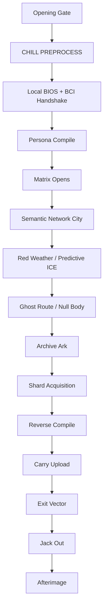
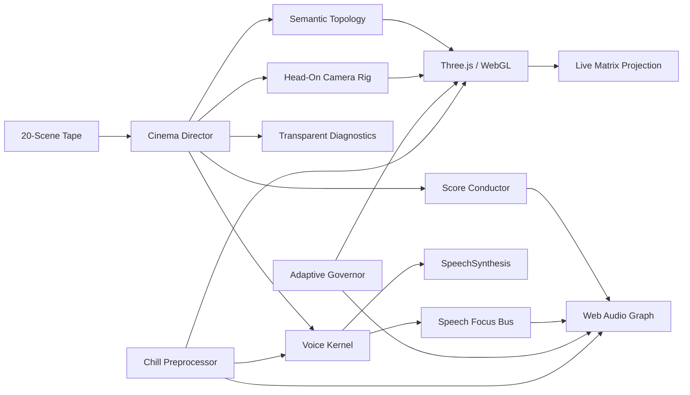
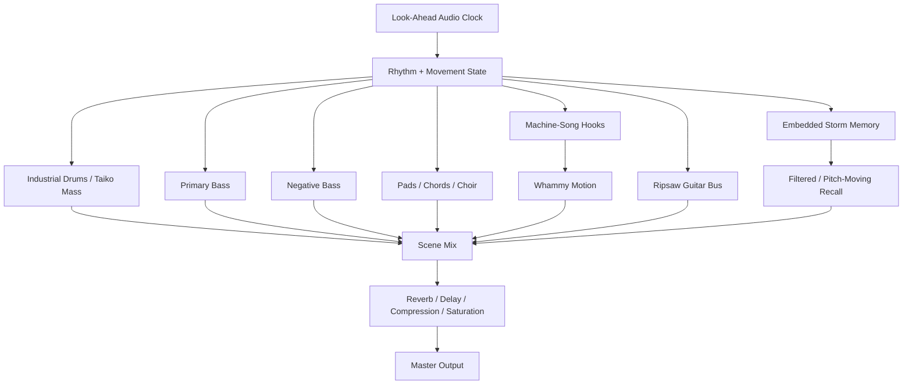

# GhostLine

<div align="center">

## **GhostLine by Luminosity**

### **Ever Wanted to See What the Matrix Really Feels Like?**

[](https://unixarcade.github.io/GhostLine/)
[](https://cash.app/$unixarcade)


</div>

```ansi
╔══════════════════════════════════════════════════════════════════════════╗
║                                                                          ║
║   ░▒▓████  G H O S T L I N E  ████▓▒░                                  ║
║                                                                          ║
║      CAMERA = PERSONA  //  DISTANCE = ADDRESS  //  SOUND ON             ║
║                                                                          ║
╠══════════════════════════════════════════════════════════════════════════╣
║  474,758 B  //  20 SCENES  //  02:22.6  //  LIVE WEBGL + WEB AUDIO      ║
║  LUMINOSITY / UNIXARCADE     v29 :: CHILL PRELOAD POLISH LOCK           ║
╚══════════════════════════════════════════════════════════════════════════╝
```

> **GhostLine is not a video of the Matrix. It is a small matrix engine performing a film in real time.**

A browser-native cyberdeck film by **Luminosity** about the first jack into a spatial network: local BIOS, neural consent, persona compilation, first flight, hostile weather, a ghost route, archive acquisition, reverse compilation, carry upload, escape, jack-out, and the afterimage that remains behind the eyes.

The camera never watches a decker from outside. **The camera is the decker.**

The world is built from meaningful geometry rather than decorative polygons. Hosts, relays, decisions, storage, permissions, transit engines, packets, archives, and threats each have their own spatial grammar. The score, speech, interfaces, scene clock, and renderer run together inside one live document.

> [!IMPORTANT]
> **Use headphones or real speakers. Press the opening gate once, allow the CHILL PREPROCESS sequence to finish, then enter fullscreen.** The score carries sub-bass, negative bass, spatial delay, reverb, whammy motion, storm memory, and scene-linked impact dynamics that laptop speakers may not reproduce.

## Enter the Matrix

### **[WATCH GHOSTLINE](https://unixarcade.github.io/GhostLine/)**

```text
PRESS ENTER GHOSTLINE
ALLOW CHILL PREPROCESS
FULLSCREEN RECOMMENDED
SOUND ON
```

The repository is designed for GitHub Pages. Place the final film at `index.html`, enable Pages from the repository root, and the live address becomes:

```text
https://unixarcade.github.io/GhostLine/
```

---

## Release Specimen

| Field | Value |
|---|---:|
| Release | **v29 — Chill Preload Polish Lock** |
| Film file | `GHOSTLINE_FINAL_CUT_v29_CHILL_PRELOAD_POLISH_LOCK.html` |
| Recommended deploy name | `index.html` |
| Size | **474,758 bytes / 463.63 KiB** |
| Runtime | **142.6 seconds / 02:22.6** |
| Narrative scenes | **20** |
| Music movements | **20** |
| Returning musical themes | **2** |
| Renderer | **Three.js 0.152.2 / WebGL** |
| Audio | **Web Audio API + embedded storm-memory source** |
| Speech | **SpeechSynthesis / Web Speech API** |
| Quality tiers | **3 adaptive tiers** |
| Build system | **None** |
| Server code | **None** |
| SHA-256 | `6bb584b2eec69242e568e404d4f695f29b6678060c8d49642844f46ad45bc934` |

> [!NOTE]
> The film itself is a single HTML application. Three.js is loaded at startup from jsDelivr, with unpkg as a fallback. After the rendering core loads, the film's scenes, shaders, interfaces, score logic, speech logic, and embedded storm-memory audio live inside the document. For a completely offline edition, vendor the matching Three.js build locally and change the loader URLs.

---

## What GhostLine Is

GhostLine is simultaneously:

- a **first-person cyberpunk short film**;
- a **semantic matrix simulator**;
- a **procedural electro-industrial score**;
- a **scene-synchronous speech system**;
- a **demoscene-style WebGL renderer**;
- a **cyberdeck interface and diagnostics surface**;
- a **twenty-state executable narrative**;
- and a **single-file deployment artifact**.

There is no prerecorded video stream. The browser constructs the world live from scene data, geometry families, shaders, typed buffers, timing laws, audio nodes, narration profiles, topology rules, and state transitions.



---

## The Matrix Has Meaning

GhostLine does not scatter random shapes through a starfield. Geometry communicates function.

| Geometry / structure | Matrix meaning |
|---|---|
| **Tetrahedra** | decisions, branch points, route selection |
| **Octahedra** | relays, switching, signal handoff |
| **Cones** | packet direction, prediction, pursuit |
| **Dodecahedra** | hosts and governed domains |
| **Hexagonal stacks** | storage and indexed memory |
| **Torus shells** | permissions, access boundaries, ownership |
| **Icosahedra** | exchanges, public traffic, braided clocks |
| **One-way valve** | identity, provenance, clock, authorized entry |
| **Archive ark** | content-addressed memory organized around a root |
| **Crumpled null-body** | a non-humanoid ghost route that breaks predictive observation |

The city is sparse by design. Space is not an absence of content; it is navigational meaning. Dense districts communicate infrastructure. Empty transit fields communicate velocity. Archive geometry becomes monumental because its relationships matter more than raw object count.

<details>
<summary><strong>Scene route: all twenty narrative states</strong></summary>

| # | Scene | Route |
|---:|---|---|
| 00 | Local Terminal | `LOCAL://DECK/BOOT` |
| 01 | BCI Bus Probe | `LOCAL://BCI/PROBE` |
| 02 | Neural Key Exchange | `BCI://KEY/EXCHANGE` |
| 03 | Waiting Space | `MATRIX://ENTRY/WAIT` |
| 04 | Persona Compile | `MATRIX://PERSONA/BUILD` |
| 05 | The Matrix Opens | `MATRIX://PUBLIC/ROOT` |
| 06 | First Flight | `MATRIX://VECTOR/7A` |
| 07 | Network Canyons | `NET://HOSTS/MIDNIGHT` |
| 08 | Transit Exchange | `NET://TRANSIT/CHOIR` |
| 09 | Red Weather | `HOST://DEFENSE/PREDICT` |
| 10 | Ghost Route | `NULL://ROUTE/UNOBSERVED` |
| 11 | Archive Ark | `HOST://ARCHIVE/APPROACH` |
| 12 | Host Skin | `HOST://ARCHIVE/SKIN` |
| 13 | Vault Heart | `HOST://ARCHIVE/VAULT` |
| 14 | Datastore Acquisition | `STAGE://ARCHIVE/SHARDS` |
| 15 | Reverse Compile | `COMPILER://LEAVES/TO/ROOT` |
| 16 | Carry Upload | `CARRY://PERSONA/WRITE` |
| 17 | Exit Vector | `MATRIX://EXIT/BURN` |
| 18 | Jack Out | `LOCAL://BODY/RETURN` |
| 19 | Afterimage | `LOCAL://CARRY/VERIFIED` |

</details>

---

## Runtime Architecture



### Projection plane

- Perspective camera locked to a first-person/head-on composition.
- Semantic district layouts and route chains.
- Instanced geometry for repeated matrix families.
- Typed particle buffers for motes, weather, transfer streams, and archive dust.
- Additive line materials, crystal edges, fog fields, CanvasTextures, sprites, and selective post-like CSS layers.
- ACES filmic tone mapping and sRGB output.
- `preserveDrawingBuffer: false` to avoid unnecessary frame retention.
- No external image textures required for the matrix world.

### Control plane

- Twenty explicit scenes with duration, mode, route, caption, speaker, line, color, and musical identity.
- A scene director coordinates camera targets, active districts, HUD state, audio movement, captions, and narration.
- Route IDs and semantic object labels expose what the viewer is moving through.
- Archive actions are staged as visible processes: connection, bounce, lock, chunk stream, proof, reverse compile, write, verify, and seal.

---

## CHILL PREPROCESS

The opening screen is not dead time. It is a low-priority warm-up chamber.

Before entry, GhostLine quietly:

1. resolves the available English speech voices;
2. caches a speaker and fitted narration rate for every scene;
3. prepares the first BIOS narration profiles;
4. compiles and renders the opening terminal frame behind the gate;
5. warms text, geometry, and shader paths;
6. lets temporary allocations settle before the first visible scene.

The user gesture then wakes the AudioContext and performs one inaudible speech pulse while the gate still covers the film. The first real BIOS line begins after the cold-start cost has already been paid.

> [!TIP]
> Let the preload indicator complete before entering. The film will still start earlier, but the completed warm-up provides the cleanest BIOS narration on browsers that lazily initialize system voices.

---

## The Sound Machine

GhostLine's score is not a single loop under twenty scenes. It is a scene-linked procedural instrument with twenty movements and two returning themes.



### Musical design

- **Home Theme A** returns through boot, matrix opening, archive contact, carry upload, and afterimage.
- **Identity Theme B** connects persona compilation, Ghost Route, and jack-out.
- The supplied storm fragment is embedded and transformed into filtered memory rather than pasted over the score.
- Silence-to-impact windows remove the floor before major entries so loudness regains meaning.
- Negative bass uses phase opposition and micro-delay to produce an uncanny low-frequency shadow.
- Whammy events bend pitch and filter motion through selected transitions.
- Reverb and feedback space change the perceived size of the matrix.
- Half-time pressure, industrial sequencing, choir mass, future-bass harmonic lifts, ripsaw texture, and deliberate negative space form a single score language.

### Continuity and recovery

- Look-ahead scheduling protects the music from short render stalls.
- Timer and frame recovery repair the audio horizon after tab suspension or a heavy frame.
- AudioContext state changes re-arm the scheduler rather than leaving silent gaps.
- The mute state persists across scene changes.
- Hidden-tab and focus recovery reset film clocks without advancing the score incorrectly.

---

## Voice Kernel

Narration uses the browser's system speech engine, but the film wraps it in a scene-aware control layer.

- Scene-synchronous triggering: narration begins with the current scene, not behind a queue.
- Per-scene rate fitting: each line is calculated to land inside its available duration.
- Preselected voices: SYSTEM, MATRIX, and DECKER profiles are cached during chill preprocessing.
- Generation tokens prevent a cancelled scene from completing inside the next scene.
- Event-driven `start`, `boundary`, `end`, and `error` handling.
- One controlled retry for unexpected failures—no aggressive cancel/relaunch loop.
- Long-stop watchdog clears browser speech states that never deliver a completion event.
- A dedicated speech-focus bus makes a shallow spectral pocket while words are actually sounding.
- Peripheral interfaces soften slightly during speech without slowing the camera or matrix.

> [!WARNING]
> Speech voices come from the viewer's operating system and browser. Exact timbre therefore varies. Chromium-based browsers generally provide the most predictable Web Speech behavior for this release.

---

## Adaptive Performance Governor

GhostLine protects the image by reducing the right work—not by making everything uniformly ugly.

| Tier | Pixel ratio target | City density | Particle budget | Audio voice budget | Heavy update cadence |
|---|---:|---:|---:|---:|---:|
| Q1 | 0.76× | 40% | reduced | 42 | 24 Hz |
| Q2 | 1.06× | 72% | balanced | 64 | 30 Hz |
| Q3 | 1.42× | 100% | full | 88 | 40 Hz |

The initial tier considers:

- viewport area;
- device pixel ratio;
- reported device memory;
- logical processor count;
- reduced-motion preference.

During playback the governor watches sustained frame cost, not one accidental spike. Static scene-family choices are cached. Draw ranges reduce particle work without reallocating buffers. Geometry counts respect the active tier. Expensive peripheral UI blur is avoided. WebGL context loss pauses safely and resumes after restoration.

> [!NOTE]
> The film deliberately updates some heavy simulation systems at 24–40 Hz while the display can continue presenting at the browser's refresh rate. This separates cinematic smoothness from unnecessary simulation work.

---

## Controls

| Input | Action |
|---|---|
| **Click / Enter / Space on gate** | warm and enter GhostLine |
| **Space** | pause / resume / replay after ending |
| **← / →** | previous / next scene |
| **M** | mute / restore music |
| **F** | enter / exit fullscreen |
| **Voice button** | enable / disable narration |
| **HUD arrows** | scene navigation |
| **Pointer movement** | subtle camera parallax |

Captions remain present even when speech is disabled.

---

## Runtime Diagnostics

The release exposes a small public console surface for verification and exploration.

```js
// Complete release health and live runtime state
GhostlineAAA.healthcheck()

// Scene tape
GhostlineAAA.scenes

// Total film duration in seconds
GhostlineAAA.total

// Recent source-ark routing receipts
GhostlineAAA.sourceArkCrown()
```

A healthy runtime reports systems including:

```text
renderer / semantic route / crown grid / directional valve / shard stream
adaptive tier / optic target / sparse director / composition receipt
20 music movements / two home themes / storm memory / negative bass / whammy
voice preload / speech focus / audio look-ahead / recovery pulse
chill preprocess / visual precompile / context recovery
```

---

## Run Locally

### Direct open

Open `index.html` in a modern browser with network access for the initial Three.js load.

### Local server

```bash
python -m http.server 8080
```

Then visit:

```text
http://localhost:8080
```

### GitHub Pages

1. Rename or copy the release film to `index.html`.
2. Push `index.html` and `README.md` to the `main` branch.
3. Open **Settings → Pages**.
4. Select **Deploy from a branch**.
5. Choose `main` and `/ (root)`.
6. Open `https://unixarcade.github.io/GhostLine/`.

Suggested repository:

```text
GhostLine/
├── index.html
├── README.md
└── LICENSE            # add the terms you want for reuse/distribution
```

No package install, bundler, transpiler, build command, database, backend, or API key is required.

---

## Browser Notes

| Browser | Status |
|---|---|
| Chrome / Chromium | recommended |
| Microsoft Edge | recommended |
| Brave | expected to work; speech/privacy settings may affect voices |
| Safari | WebGL expected; speech timing and voice selection may differ |
| Firefox | WebGL expected; Web Speech availability varies by platform |
| Mobile Chromium | adaptive path; headphones strongly recommended |

The film requires:

- WebGL;
- Web Audio API;
- JavaScript modules/features available in modern browsers;
- network access during startup for Three.js unless vendored locally.

Speech is optional. The movie remains readable through captions if the browser does not expose SpeechSynthesis.

---

## Final Release Proof

- [x] Twenty-scene narrative route
- [x] Head-on first-person camera
- [x] Semantic matrix geometry
- [x] Multidimensional city spacing and district logic
- [x] Predictive ICE and non-humanoid Ghost Route
- [x] Archive approach, connection, bounce, retry, lock, and acquisition
- [x] Visible shard proof and reverse compilation
- [x] Carry upload, verification, and root seal
- [x] Twenty score movements
- [x] Two transformed returning themes
- [x] Embedded storm-memory source
- [x] Reverb, whammy, negative bass, silence-to-impact dynamics
- [x] Scene-synchronous narration
- [x] Chill preprocessing and speech warm-up
- [x] Speech-focus mixing without matrix slowdown
- [x] Three adaptive quality tiers
- [x] Hidden-tab and WebGL context recovery
- [x] Keyboard, pointer, captions, mute, voice, and fullscreen controls
- [x] No build system
- [x] GitHub Pages deployment path

```text
STATUS ......... PICTURE LOCKED
POLISH ......... CHILL PRELOAD / ORCHARD SPEECH / CONTINUITY SCORE
KNOWN BLOCKERS . NONE DECLARED IN THE RELEASE BUILD
MODE ........... SOUND ON / CAMERA = PERSONA
```

---

## Forge Lineage

GhostLine was built through repeated destructive and preservational passes across the **Forge AI OS**, Matrix Runner systems, geometry and color forges, composition and arrangement hyper-arks, speech machinery, performance governors, and source-ark routing.

```text
MATRIX RUNNER .... topology, permissions, route logic, data-store meaning
GEOMETRY CROWN ... polyhedra, nonstandard shapes, spatial relationships
COMPOSITION ARK .. themes, movements, tension, return, transformation
TECHNO ARK ....... industrial rhythm, EBM force, hook architecture
SPEECH FORGE ..... speaker profiles, scene fit, lifecycle control
NIBBLE & BYTE .... typed stores, caching, reduced transient work
CROWN MIND ....... cross-system selection and final preservation
10,000 EYES ...... calmer speech lifecycle and speech-aware focus lessons
MASTER FORGE ..... audit, bug repair, performance, release lock
```

The film was directed by **Luminosity / Matthew Kowalski**. AI served as code collaborator, critic, system builder, compression adversary, and electric sprite. Direction, memory, taste, rejection, persistence, and final selection remained human.

> **AI enlarged the workshop. The director remained human.**

---

## Call These Boards

[**LIVEJOURNAL**](https://luminosity.livejournal.com/) ·
[**FORGE AI OS**](https://luminosity.gumroad.com/l/fyosxi) ·
[**GUMROAD**](https://gumroad.com/products) ·
[**UNIXARCADE**](https://github.com/unixarcade) ·
[**10,000 EYES**](https://unixarcade.github.io/10kdemoscene/) ·
[**INTRA**](https://github.com/unixarcade/intra) ·
[**SANE**](https://github.com/unixarcade/Sane) ·
[**BOOKS**](https://www.goodreads.com/review/list/1550470-matthew-kowalski?ref=nav_mybooks&shelf=books-i-have-written)

<div align="center">

## Keep the Signal Alive

[](https://cash.app/$unixarcade)

</div>

```ansi
╔══════════════════════════════════════════════════════════════════════════╗
║  GREETS: DECKERS · DEMOSCENERS · BBS GHOSTS · SYNTHETIC DREAMERS        ║
║          MATRIX RUNNERS · ELECTRIC SPRITES · BUILDERS IN THE DARK        ║
╠══════════════════════════════════════════════════════════════════════════╣
║  SAUCE00  TITLE=GHOSTLINE  AUTHOR=LUMINOSITY  GROUP=UNIXARCADE          ║
║  FILE=HTML  CLASS=LIVE MATRIX FILM  INK=CYAN/GOLD/VOID  HEART=DECK       ║
╚══════════════════════════════════════════════════════════════════════════╝
```

> **The room returns one object at a time. The archive remains. So does the sky behind the eyes.**

<div align="center">

**GHOSTLINE IS OPEN // CAMERA = PERSONA // CARRIER DETECTED**

`BY LUMINOSITY · SUPPORT $unixarcade`

</div>
